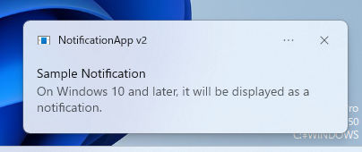
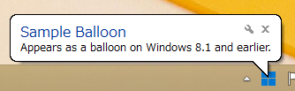
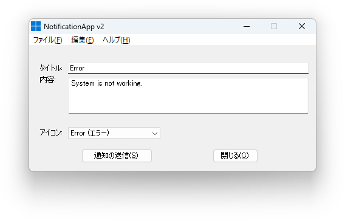

# NotificationApp v2
This is a new version of NotificationApp.

# How to use
No different from [NotificationApp](https://yuuya20061202.wixsite.com/website/%E4%BB%BB%E6%84%8F%E3%81%AE%E5%86%85%E5%AE%B9%E3%81%A7%E9%80%9A%E7%9F%A5%E3%82%92%E9%80%81%E4%BF%A1).

# New Features
* You can now specify icons (``None``, ``Warning``, ``Error``, ``Information``) for notifications.

# FAQ
## How do notifications appear?
Notification display differs between Windows 10 and later and Windows 8.1 and earlier.
### Windows 10 and later
Sent as a notification on Windows 10 and later. 

### Windows 8.1 and earlier
Displayed as a balloon on Windows 8.1 and earlier. 

# Usage
Please feel free to use it for any purpose. (Entertainment purposes, educational purposes, Crazy Error, etc.)

# Screenshot
If you're curious about what this program looks like, take a look at the image below. 

# Download
This program can be downloaded [here]([https://github.com/YuuyaGitHub/CS-Apps-Repository/blob/main/NotificationApp%20v2/bin/Release/NotificationApp%20v2.exe](https://github.com/YuuyaGitHub/CS-Apps-Repository/raw/main/NotificationApp%20v2/bin/Release/NotificationApp%20v2.exe)https://github.com/YuuyaGitHub/CS-Apps-Repository/raw/main/NotificationApp%20v2/bin/Release/NotificationApp%20v2.exe).
