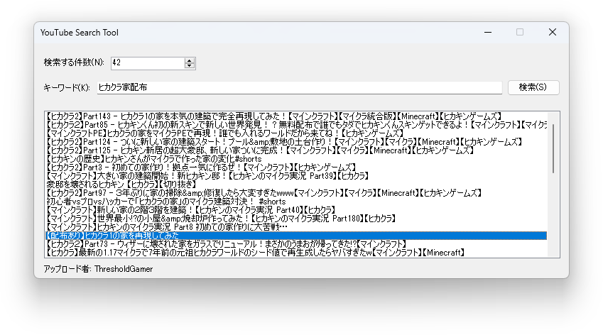

# YouTube Search Tool
This program is a program that searches YouTube using specified keywords.

# Other features
* You can double-click to view the video.
* The uploader will be displayed below the video list.

# Limit
Due to Google API limitations, searching multiple times in a day will result in a ```Google.GoogleApiException``` exception. There is a way to fix this, but the steps are complicated, so I recommend that someone knowledgeable do this.

# Disclaimer
**Do not decompile EXE files**. (Because I have my own YouTube API Key)
<br>Also, if you compile using the source code, please use your YouTube API Key (otherwise it will not work).
<br>Please see [here](https://www.youtube.com/watch?v=uz7dY8qTFJw) for details on how to obtain an API key.

# Known bugs
* You can change the window size (my mistake, there are no plans to release a fixed version, and there is no way to fix it.)

# Download
This program can be downloaded [here](https://github.com/YuuyaGitHub/CS-Apps-Repository/raw/main/YouTube%20Search%20Tool/YouTube%20Search%20Tool.zip). (Password: YuuyaYTSearch)

# Screenshot
Below is a screenshot of this program:

